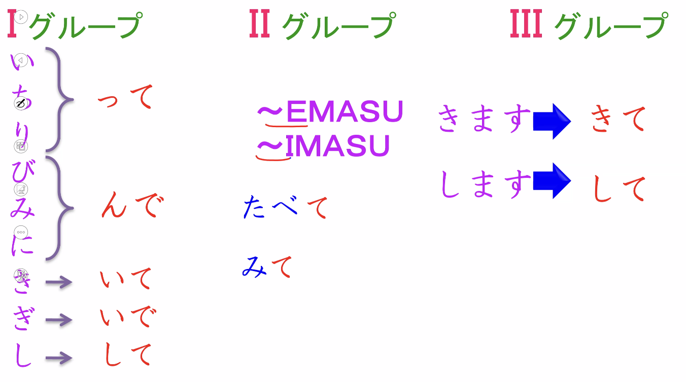

# 002

## Can Do

- Falar de forma simples onde voce e sua familia mora e fazem
- Falar sobre os idiomas
- Falar sobre hobbies, passatempos

## Vocab

- kazoku: parentes/familia
- ryoushin: pais (chichi to haha)
- kyoudai: irmãos (ani, ane, atouto, imouto)
- shimai: irmãs
- kodomo: filhos
  - musuko: filho
  - musume: filha

## Questions

- Doko ni sundeimasuka
  - sao pauro ni sundeimasu
- kazoku wa nanindesuka
  - watashi no kazoku wa rokunin desu
  - chichi to haha to watashi to sanin otouto desu
- Shigoto wa nandesuka
  - watashi wa softwa engineea desu
- doko de hataraiteimasuka
  - quinto andar de hataraiteimasu
- nani wo benkyou shiteimasuka
  - machine learning wo benkyou shiteimasu
- doko de benkyou shiteimasuka
  - ie de benkyou shiteimasu

## Verb

- hataraimasu = trabalhar
- hataraiteimasu = trabalho atualmente (verbo em ação contínua) - comecei a trabalhar em um lugar e continuo
- verbo-te + imasu = ação contínua, está no meu presente, no meu agora

## Verb-Te

- grupo I
- grupo II
  - emasu:
    - tabemasu => tabeteimasu
    - nemasu => neteimasu
    - mimasu => miteimasu
  - imasu: 
- grupo III
  - kimasu
    - kimasu => kiteimasu
  - shimasu
    - shigoto wo shimasu => shigoto wo shiteimasu
    - kaimono wo shimasu => koimno wo shiteimasu

## Jikoshoukai

- minnasan hajimemashite
- watashi wa kinoshita reandoro desu
- sao pauro ni sundeimasu
- watashi no kazoku wa rokunin desu
- chichi to haha to sanin otouto desu
- watashi wa softwa engineea desu
- **quintoandar** de hataraiteimasu
- douzo yoroshiku onegaishimasu

---

- watashi wa kinoshita reandoro desu
- burajirujin desu
- watashi wa porutogarugo to eigo ga dekimasu. nihongo mo sukoshi dekimasu
- obaachan wa nijonjin desu. porutogarugo to nihongo ga dekimasu
- watashitachi wa nihongo to porutogarugo de hanashimasu

## Shumi

- shumi wa supotsu desu
- shumi wa ongaku desu
- eiga ga desu
- dokushou (leitura) desu
- watashi no shumi wa dokushou desu

Shumi + ações

- ryouri wo tsukurimasu
  - watashi no shumi wa ryouri wo tsukuru koto desu

- grupo I
  - i => u
  - kaimasu => kau
- grupo II
  - emasu: 
    - tabemasu => taberu
    - nemasu => neru
  - imasu: 
    - mimasu => miru
- grupo III
  - shimasu: kuru
  - kimasu: suru

kodomo no toki: nos tempos de kodomo
wakai toki

## Exercises

- [te-form](https://docs.google.com/forms/d/e/1FAIpQLSfWYr2KWL2YxklJBUTm3G7fDhR5aMA5zPP6ML-OKVNnYJsNBg/viewform)
