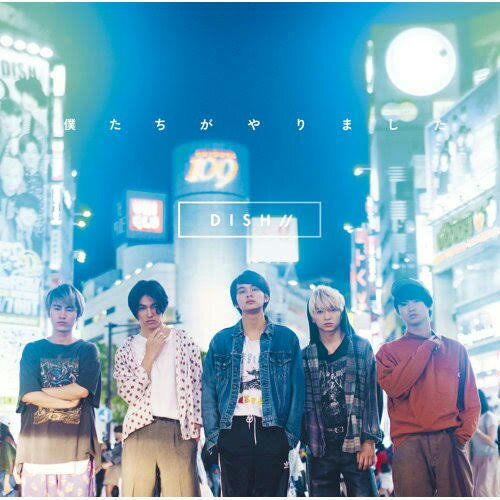

# Neko Lyrics Translation

Band: Dish//

| Kanji                                   | Hiragana / Katakana            | Romaji                              | English                                         |
| --------------------------------------- | ------------------------------ | ----------------------------------- | ----------------------------------------------- |
| 夕焼けが燃えてこの街ごと                | ゆうやけがもえとこのまちごと   | yūyake ga moete kono machigoto      | The red sunset burned with the town             |
| 飲み込んでしまいそうな今日に            | のみこんでしまいそうなきょうに | nomikonde shimai sou na kyou ni     | Today, I might end up taking it all in          |
| 僕は君を手放してしまった                | ぼくわきみをてばなしてしまった | boku wa kimi o tebanashite shimatta | And today, I ended up letting go of you         |
| 明日が不安だ とても嫌だ                 | あしたがふあんだとてもいやだ   | ashita ga fuanda totemo iyada       | I feel anxious about tomorrow, I really hate it |
| だからこの僕も一緒に                    |                                |                                     |                                                 |
| 飲み込んでしまえよ 夕焼け               |                                |                                     |                                                 |
| だけどもそうはいかないよな              |                                |                                     |                                                 |
| 明日ってウザいほど来るよな              |                                |                                     |                                                 |
| 眠たい夜になんだか笑っちゃう            |                                |                                     |                                                 |
| 家まで帰ろう 1 人で帰ろう               |                                |                                     |                                                 |
| 昨日のことなど 幻だと思おう             |                                |                                     |                                                 |
| 君の顔なんて忘れてやるさ                |                                |                                     |                                                 |
| 馬鹿 馬鹿しいだろ、そうだろ             |                                |                                     |                                                 |
| 君がいなくなった日々も                  |                                |                                     |                                                 |
| このどうしようもない気だるさも          |                                |                                     |                                                 |
| 心と体が喧嘩して                        |                                |                                     |                                                 |
| 頼りない僕は寝転んで                    |                                |                                     |                                                 |
| 猫になったんだよな 君は                 |                                |                                     |                                                 |
| いつかフラッと現れてくれ                |                                |                                     |                                                 |
| 何気ない毎日を君色に染めておくれよ      |                                |                                     |                                                 |
| 夕焼けが燃えてこの街ごと                |                                |                                     |                                                 |
| 飲み込んでしまいそうな今日に            |                                |                                     |                                                 |
| 僕は君を手放してしまった                |                                |                                     |                                                 |
| 若すぎる僕らはまた 1 から               |                                |                                     |                                                 |
| 出会うことは可能なのかな                |                                |                                     |                                                 |
| 願うだけ無駄ならもうダメだ              |                                |                                     |                                                 |
| 家までつくのが こんなにも嫌だ           |                                |                                     |                                                 |
| 歩くスピードは 君が隣にいる時のまんま   |                                |                                     |                                                 |
| 想い出巡らせ がんじがらめのため息ばっか |                                |                                     |                                                 |
| 馬鹿にしろよ、笑えよ                    |                                |                                     |                                                 |
| 君がいなくなった日々は                  |                                |                                     |                                                 |
| 面白いくらいにつまらない                |                                |                                     |                                                 |
| 全力で忘れようとするけど                |                                |                                     |                                                 |
| 全身で君を求めてる                      |                                |                                     |                                                 |
| 猫になったんだよな 君は                 |                                |                                     |                                                 |

## Resources

- [DISH// – 猫 (Neko) Kanji + Romanization + English Lyrics Translation](https://meikatsudon.tumblr.com/post/164867209482/dish-neko-english-translation)
- [Jisho](https://jisho.org/)
